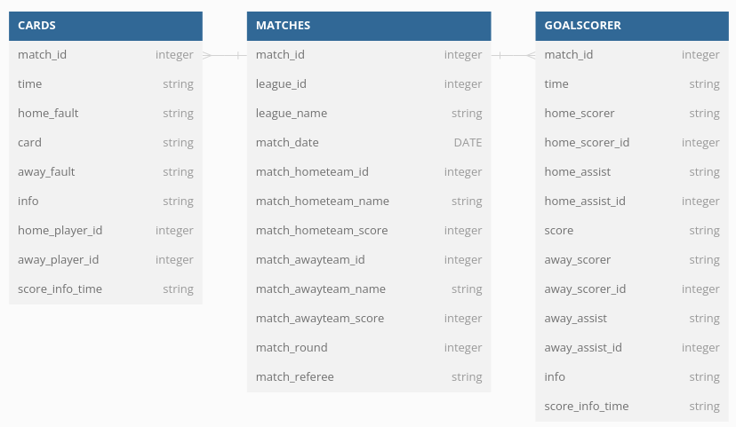

# API Footbal Task

This project uses docker containers to spin up a Mysql Database and run a series of Python scripts to extract data from English Premier League matches from API Football, process and select fields, store on Mysql, perform some queries and return reports on csv files.

---

## Ownership
**Developer:** @jefersonmsantos


## Local Usage

1. Clone the repository
2. Be sure to have docker and docker-compose installed on your local machine
3. Register an account on the [apifootball site](https://apifootball.com/) (opt for a [temporary email](https://temp-mail.org/en/) for convenience) and secure the API key.
4. Export the secured API key on a Environment Variable called API_KEY
```console
  export API_KEY=<your-api-key-from-apifootball>
  ```
5. In the main folder of the repo, execute the command below to start application
```console
  docker-compose up
  ```
6. When the process finishes, you should find the generated .csv files in the folder /artifact/files
7. To stop the process, press Ctrl+C, and then execute
```console
  docker-compose rm
  ```


## Architechture
The docker-compose.yml file spins up two containers: db and football-app

### db
- It is a Mysql 8 database which will be used by football-app to store data and perform queries. This database can be accessed locally on localhost:3308, with user an password provided on docker-compose.yml

### football-app
- Image for this container is created with Dockerfile.
- Python files executed by this container are in the folder artifact.
- Image executes file main.py, that executes the following scripts in sequence:
    - **create_tables.py**: This file connects to the mysql db and create the three following tables represented on the model:

        


        - MATCHES: contains data from each match, with teams, score, referee, round and date. Its unique column is match_id
        - GOALSCORER: has the players who scored goal on each match. Relates to MATCHES table by match_id
        - CARDS: has the cards received by players on each match. Relates to MATCHES by match_id


    - **import_data.py**: This file connects to apifootball Events endpoint and request data for the English Premier Leage 2022 - 2023 season. Request is processed to generate three lists of dictionaries, one for each table described on the previous session. Each dictionary on the list is one row which is then inserted on each table. The fields selected from the API response are the one used to create the tables.

    - **query_and_export_data.py**: This file perform 4 queries on db:
        - Final League Table: outputs the following columns: position, team_name, matches_played, won, draw, lost, goals_scored, goals_conceded, and points.
            Points allocation:
            - Victories: 3 points each
            - Draws: 1 point each
            - Defeats: 0 points
            - In case of points tie, utilize these tiebreakers:
                - Superior goal difference
                - Higher goals scored
                - Fewer goals conceded
                - More victories
        - Display all teams sorted by Away goals scored. Columns: team_name, goals.
        - Top 5 Referees with Most Cards: Columns: referee_name, cards
        - Top 3 Goal Scorers by Match Round 14: Columns: player_name, team_name, and goals 

        The .sql files for these queries are on artifact/queries folder. When it finishes, the 4 .csv files will be available on folder artifact/files on your local machine